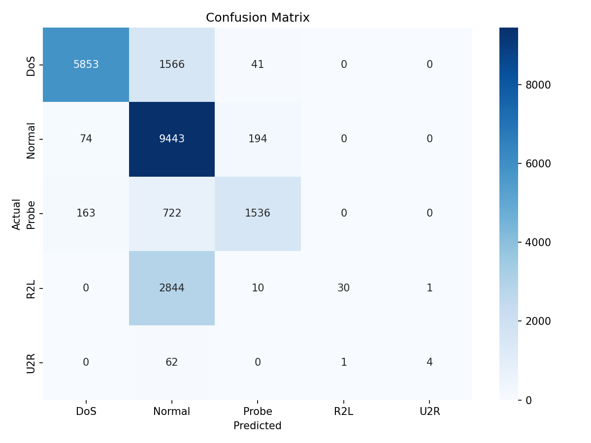

**Course:** Advanced Python (ICS0019)

**Team members:** Stefan Stoiana-Mois, Ian Tuttle

**Date:** 23.05.2026

Repository link: https://github.com/caramida91/llmtrain.git

---

## 1. Approach

### 1.1 Strategy Overview

The goal of this assignment was to train a machine learning model for network intrusion detection using the NSL-KDD dataset. The model had to classify each network connection into one of five categories: Normal, DoS, Probe, R2L, and U2R.

Our initial strategy was simple: first create a working baseline using Random Forest, then improve it by changing parameters and checking whether class imbalance handling improves the macro F1-score. Since the assignment metric was macro F1-score, we focused not only on overall accuracy, but also on how well the model handled rare classes such as R2L and U2R.

We decided to use Random Forest because it works well with structured/tabular data, trains relatively fast, and provides a strong baseline. After that, we experimented with class weights, number of trees, and tree depth.

### 1.2 Preprocessing

We used the preprocessing steps from the starter code.

- **Feature engineering:** No additional features were created. We kept the original NSL-KDD features.
- **Feature selection:** The column `num_outbound_cmds` was removed because it is always zero and does not provide useful information.
- **Scaling:** No scaling was applied. Random Forest is a tree-based model, so it does not require StandardScaler or MinMaxScaler.
- **Categorical encoding:** The categorical columns `protocol_type`, `service`, and `flag` were encoded using `LabelEncoder`.
- **Attack mapping:** The original attack labels were mapped into five main categories: Normal, DoS, Probe, R2L, and U2R.
- **Other:** The difficulty `level` column was dropped because it is not a feature used for classification.

### 1.3 Class Imbalance Handling

The NSL-KDD dataset is highly imbalanced. Normal and DoS traffic have many records, while U2R has very few examples. Because macro F1-score gives equal importance to each class, this imbalance is a major challenge.

We tested two approaches:

- **Method used:** Random Forest with and without `class_weight='balanced'`
- **Parameters tested:** `class_weight=None` and `class_weight='balanced'`
- **Effect on training set distribution:** The actual training set distribution was not changed because we did not use oversampling or undersampling. Instead, class weighting changed how much importance the model gave to each class during training.

Surprisingly, `class_weight='balanced'` did not improve the final test macro F1-score in our experiments. The best final model used `class_weight=None`.

---

## 2. Experiments

### Total number of experiments:

We ran 5 main experiments.

### Experiment 1: Balanced Random Forest

- **Algorithm:** Random Forest
- **What changed from baseline:** Used `class_weight='balanced'`
- **Macro F1 (CV):** 0.9064 ± 0.0392
- **Macro F1 (test):** 0.4748
- **Observation:** This experiment was close to the assignment baseline. It performed well on Normal, DoS, and Probe, but it still failed almost completely on R2L and U2R.

### Experiment 2: Basic Random Forest

- **Algorithm:** Random Forest
- **What changed:** Removed class balancing by setting `class_weight=None`
- **Macro F1 (CV):** 0.9148 ± 0.0400
- **Macro F1 (test):** 0.4938
- **Observation:** This performed better than the balanced version. It improved the macro F1-score slightly and showed that class weighting was not automatically helpful for this dataset.

### Experiment 3: More Trees Without Class Weighting

- **Algorithm:** Random Forest
- **What changed:** Increased the number of trees while keeping `class_weight=None`
- **Macro F1 (CV):** 0.9138 ± 0.0411
- **Macro F1 (test):** 0.4956
- **Observation:** Adding more trees gave a small improvement. The model became slightly more stable, but R2L and U2R were still difficult.

### Experiment 4: Limited Depth With More Trees

- **Algorithm:** Random Forest
- **What changed:** Used more trees and limited the maximum tree depth
- **Macro F1 (CV):** 0.9169 ± 0.0374
- **Macro F1 (test):** 0.5005
- **Observation:** This was our best practical model. Limiting the tree depth helped generalization and gave the best balance between performance and training time.

### Experiment 5: 1000 Trees With Limited Depth

- **Algorithm:** Random Forest
- **What changed:** Increased the number of trees to 1000
- **Macro F1 (CV):** 0.9147 ± 0.0336
- **Macro F1 (test):** 0.5007
- **Observation:** This gave a very tiny improvement over Experiment 4, but the difference was only 0.0002. Because the improvement was extremely small and training time was higher, we decided Experiment 4 was the better final choice.

### Experiments Summary

| # | Description                | Algorithm     | Imbalance Handling        | Macro F1 (CV)   | Macro F1 (test) |
|---|----------------------------|---------------|---------------------------|-----------------|-----------------|
| 1 | Balanced Random Forest     | Random Forest | `class_weight='balanced'` | 0.9064 ± 0.0392 | 0.4748          |
| 2 | Basic Random Forest        | Random Forest | None                      | 0.9148 ± 0.0400 | 0.4938          |
| 3 | More trees                 | Random Forest | None                      | 0.9138 ± 0.0411 | 0.4956          |
| 4 | More trees + limited depth | Random Forest | None                      | 0.9169 ± 0.0374 | 0.5005          |
| 5 | 1000 trees + limited depth | Random Forest | None                      | 0.9147 ± 0.0336 | 0.5007          |

>side experiment: balanced random forest + more trees resulted into worse results so we didn't add it here

---

## 3. Final Results

### 3.1 Best Model

- **Algorithm:** Random Forest
- **Key parameters:**
  - `n_estimators=500`
  - `max_depth=20`
  - `min_samples_split=2`
  - `class_weight=None`
  - `random_state=42`
  - `n_jobs=-1`
- **Imbalance handling:** No resampling was used in the final model. We tested class weighting, but it did not improve the final test score.
- **Feature engineering:** No new features were added. We used the original dataset features after categorical encoding and removal of the constant column.

### 3.2 Final Macro F1-Score

| Metric              | Score           |
|---------------------|-----------------|
| **Macro F1 (test)** | **0.5005**      |
| Macro F1 (CV)       | 0.9169 ± 0.0374 |

The final model improved over the provided baseline macro F1-score of approximately 0.47.

### 3.3 Classification Report

| Category | Precision | Recall | F1-Score | Support |
|----------|-----------|--------|----------|---------|
| DoS      | 0.96      | 0.78   | 0.86     | 7460    |
| Normal   | 0.65      | 0.97   | 0.78     | 9711    |
| Probe    | 0.86      | 0.63   | 0.73     | 2421    |
| R2L      | 0.97      | 0.01   | 0.02     | 2885    |
| U2R      | 0.80      | 0.06   | 0.11     | 67      |

Overall results:

| Metric                    | Score |
|---------------------------|-------|
| Accuracy                  | 0.75  |
| Macro average F1-score    | 0.50  |
| Weighted average F1-score | 0.70  |

The model performed well on DoS, Normal, and Probe traffic. However, it struggled with R2L and U2R attacks. This is expected because these classes are rare and harder to distinguish from normal traffic.

### 3.4 Confusion Matrix

The confusion matrix shows that the model correctly classified many Normal, DoS, and Probe samples. However, most R2L attacks were classified as Normal. This means the model still has difficulty detecting remote-to-local attacks.

---

## 4. Cross-Validation vs. Test Score

- **CV macro F1:** 0.9169 ± 0.0374
- **Test macro F1:** 0.5005
- **Gap:** 0.4164

**Analysis:**

There is a large gap between the cross-validation score and the final test score. The cross-validation score was much higher because it was calculated only on the training data split. The final test set is harder because KDDTest+ contains attack types that do not appear in the training set.

This means the model learned the training distribution well, but it did not generalize perfectly to unseen attacks. The gap may also indicate some overfitting, especially because the Random Forest model performs very strongly during cross-validation but much worse on the final test set.

The biggest problem is with R2L and U2R. These classes have low recall, which means the model misses most of those attacks. This strongly lowers the macro F1-score, even though the accuracy is still around 75%.

---

## 5. What Worked and What Didn't

### What had the biggest positive impact?

The biggest positive impact came from limiting the tree depth while using more trees. The best practical model used 500 trees and `max_depth=20`. This improved the test macro F1-score to 0.5005, which was better than the assignment baseline of approximately 0.47.

Removing `class_weight='balanced'` also surprisingly improved the score. The basic Random Forest with no class weighting performed better than the balanced version.

### What surprisingly didn't help?

Class weighting did not help in our experiments. We expected `class_weight='balanced'` to improve R2L and U2R detection, but the final test macro F1-score was lower than the model without class weighting.

Increasing the number of trees to 1000 also did not help much. It improved the test macro F1-score only from 0.5005 to 0.5007, which is too small to justify the extra training time.

The model still did not solve the main issue: R2L and U2R detection. Most R2L attacks were classified as Normal, which shows that these attack types are difficult for the model to separate.

### What would you try with more time?

With more time, we would try:

- XGBoost or LightGBM instead of Random Forest
- SMOTE or SMOTEENN to generate more examples for R2L and U2R
- Threshold tuning to increase recall for rare classes
- Feature engineering, such as ratios between `src_bytes` and `dst_bytes`
- Stacking multiple models together
- Training a separate binary classifier for rare attack classes such as R2L and U2R

These methods could potentially improve the detection of rare attacks and increase the macro F1-score.

---

## Appendix: Environment

- **Hardware:** Intel Core i9-13900H, RTX 5060 8GB Laptop VRAM, 16GB RAM 
- **Python version:** Python 3.13
- **Key libraries:**
  - pandas
  - numpy
  - scikit-learn
  - matplotlib
  - seaborn
  - imbalanced-learn
  - xgboost
- **Random seed:** 42